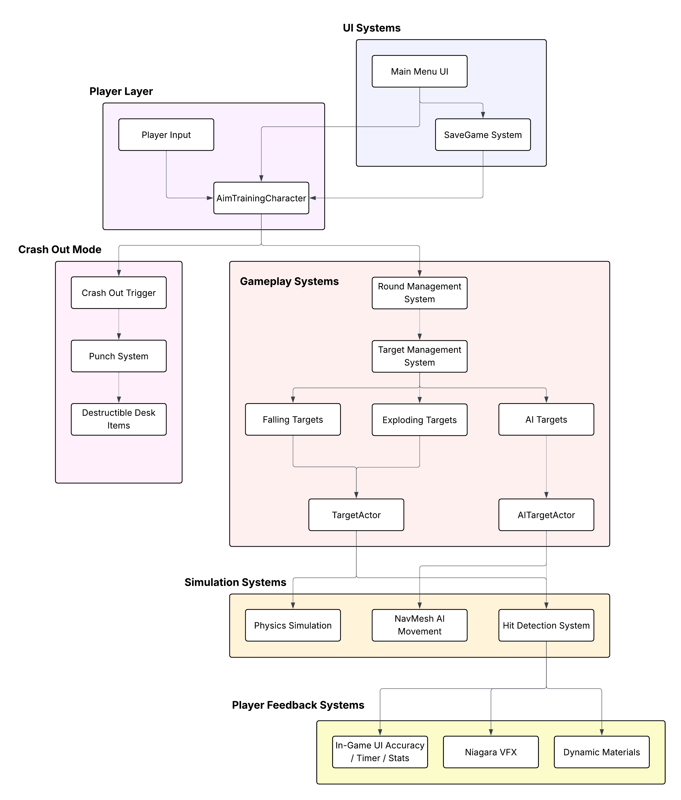

# Aim Trainer System (Unreal Engine 5, C++)

## Overview
This project is a modular aim training system built in Unreal Engine 5 using C++. It is designed to simulate different aiming scenarios while tracking player performance in real time.

The system focuses on separating gameplay logic, simulation, and feedback systems to support scalability and extensibility across multiple training modes.

---

## Key Features

- Three-stage aim training system:
  - Falling Targets (gravity-based reactions)
  - Exploding Targets (physics impulse and spatial flicking)
  - AI Targets (NavMesh-driven movement and tracking)
- Real-time performance tracking:
  - Accuracy
  - Shots fired / hits
  - Round-based progression
- Dynamic feedback systems:
  - UI updates (accuracy, timer, stats)
  - Visual effects (Niagara hit effects)
  - Dynamic materials (state-based feedback)
- Crash Out Coach mode:
  - Unlocks when accuracy drops below threshold
  - Physics-based interaction system for throwing desk items
- Save system:
  - Stores player sensitivity settings across sessions

---

## System Architecture

This architecture separates core responsibilities into distinct layers:

- **Player Layer** – Handles input and player control
- **Gameplay Systems** – Manages rounds, spawning, and target behaviours
- **Simulation Systems** – Controls physics, AI movement, and hit detection
- **Player Feedback Systems** – Communicates performance through UI and effects
- **Persistence & UI Systems** – Handles menus and saved player data

This structure allows new gameplay modes and target behaviours to be added without modifying core systems.

---

## Core Systems

### AimTrainingCharacter
- Central controller for player actions and game state
- Handles shooting, accuracy tracking, and mode transitions
- Connects gameplay systems with feedback and persistence

---

### Target Management System
- Spawns and manages targets based on round type
- Supports multiple behaviours:
  - Physics-driven (falling / exploding)
  - AI-controlled movement
- Ensures continuous gameplay through respawning logic

---

### Round Management System
- Controls progression between training stages
- Manages timers and round transitions
- Triggers UI flow (next / retry / quit)

---

### Simulation Systems
- **Physics Simulation**: Handles falling and impulse-based targets
- **NavMesh AI Movement**: Drives autonomous target behaviour
- **Hit Detection**: Uses line tracing to register shots and update stats

---

### Player Feedback Systems
- **UI System**: Displays accuracy, timer, and session stats
- **Niagara VFX**: Provides visual hit feedback
- **Dynamic Materials**: Signals state changes (e.g. crash out mode)

---

### Persistence System
- Saves and loads player sensitivity settings
- Ensures consistent player experience across sessions

---

### Crash Out Mode
- Triggered when player accuracy drops below 70%
- Switches gameplay into a physics-based interaction mode
- Allows player to interact with destructible objects as a break from training

---

## Technical Highlights

- Modular system design with clear separation of concerns
- NavMesh-based spawning and AI movement
- Physics-driven gameplay using Unreal Engine systems
- Real-time stat tracking and UI binding
- Extendable architecture for adding new training scenarios

---

## Future Improvements

- Backend integration for persistent player stats
- Customisable training scenarios (user-selected drills)
- Difficulty scaling system based on performance
- Expanded AI behaviours and movement patterns

---

## Motivation

This project was inspired by competitive aim trainers (e.g. Aimlabs, Kovaaks) and my experience coaching high-level VALORANT teams.

The goal was to create a system that not only trains mechanical skill, but also introduces variation, feedback, and player engagement through layered gameplay systems.
