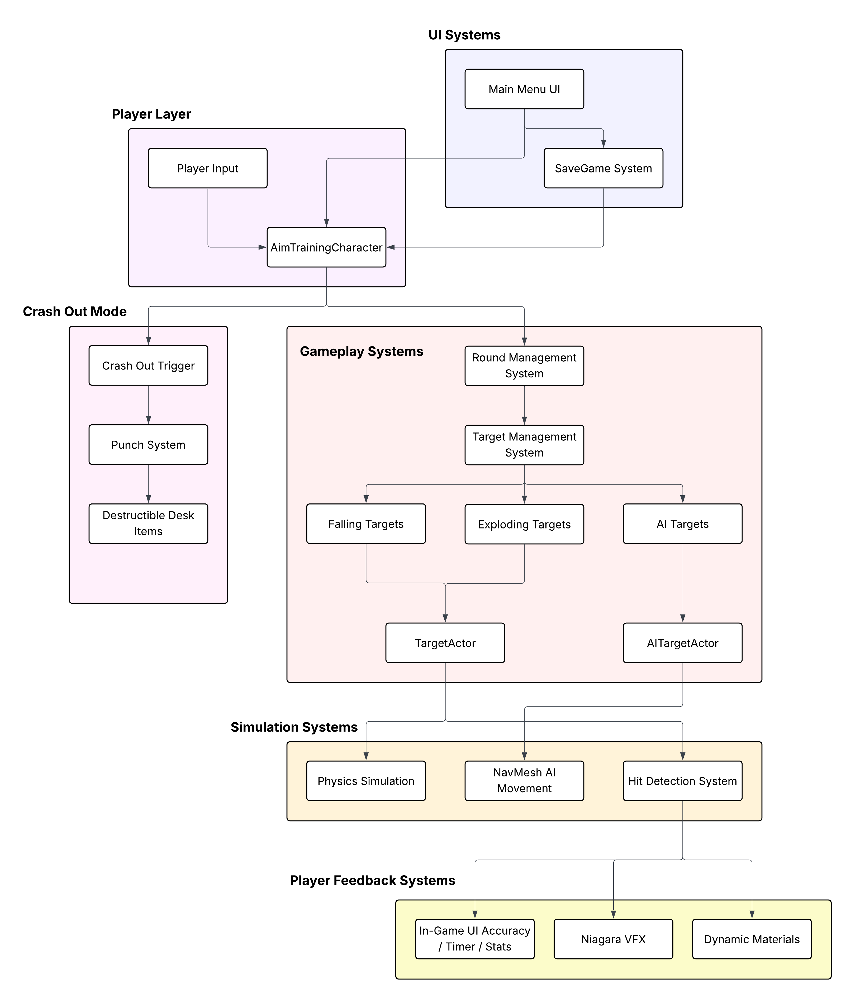

# Aim Trainer System (Unreal Engine 5, C++)

## Overview
This project is a modular aim training system built in Unreal Engine 5 using C++. It is designed to simulate different aiming scenarios while tracking player performance in real time.

The system focuses on separating gameplay logic, simulation, and feedback systems to support scalability and extensibility across multiple training modes.

## Key Features

- Three-stage aim training system:
  - Falling Targets (gravity-based reactions)
  - Exploding Targets (physics impulse and spatial flicking)
  - AI Targets (NavMesh-driven movement and tracking)
- Real-time performance tracking:
  - Accuracy
  - Shots fired / hits
  - Round-based progression
- Dynamic feedback systems:
  - UI updates (accuracy, timer, stats)
  - Visual effects (Niagara hit effects)
  - Dynamic materials (state-based feedback)
- Crash Out Coach mode:
  - Unlocks when accuracy drops below threshold
  - Physics-based interaction system for throwing desk items
- Save system:
  - Stores player sensitivity settings across sessions

## System Architecture

This architecture separates core responsibilities into distinct layers:

- **Player Layer** – Handles input and player control
- **Gameplay Systems** – Manages rounds, spawning, and target behaviours
- **Simulation Systems** – Controls physics, AI movement, and hit detection
- **Player Feedback Systems** – Communicates performance through UI and effects
- **Persistence & UI Systems** – Handles menus and saved player data

This structure allows new gameplay modes and target behaviours to be added without modifying core systems.

